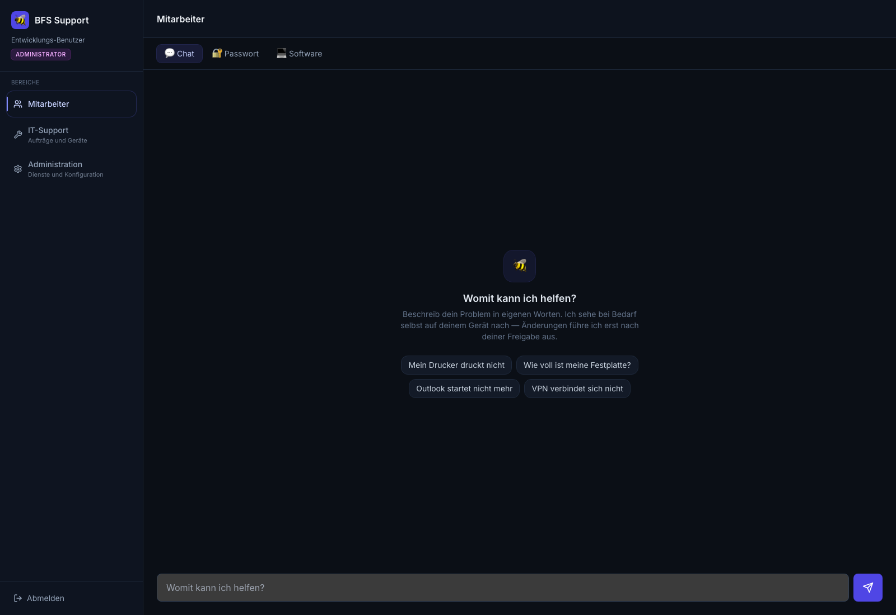
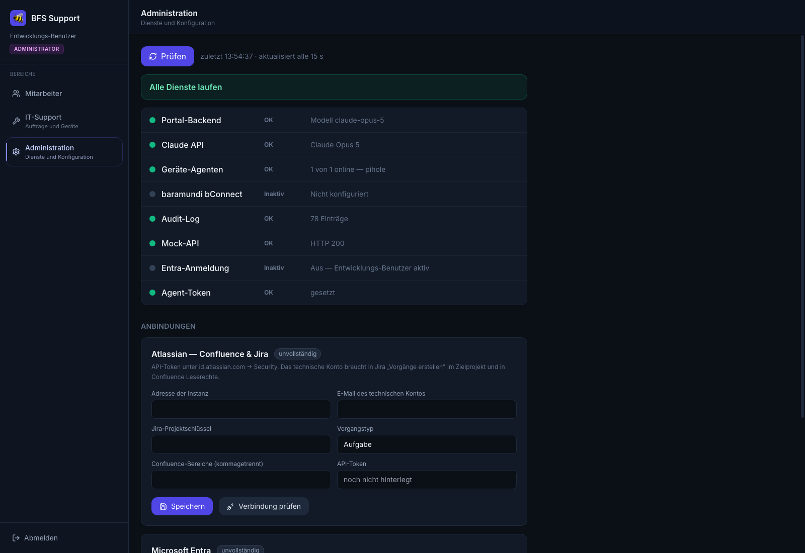

# BFS Self-Service Portal

KI-gestützter 1st-Level-IT-Support: Mitarbeitende beschreiben ihr Problem im
Chat, das Modell stellt Diagnosen über einen Agenten auf dem betroffenen Gerät,
und ändernde Eingriffe laufen erst nach ausdrücklicher Freigabe in der
Oberfläche — jeder Schritt im Audit-Log.

> **Status: Prototyp, keine Produktivumgebung.** Läuft auf einem Raspberry Pi
> als Prüfstand. Hochverfügbarkeit, Alarmierung und Backups sind bewusst kein
> Ziel. Was verifiziert ist und was noch offen ist, steht in
> [`docs/STATUS.md`](docs/STATUS.md).



## Die Idee

Klassischer 1st-Level-Support besteht zu großen Teilen aus immer denselben
Handgriffen: Platte voll, Dienst hängt, Konto gesperrt, Passwort vergessen.
Das Portal lässt ein Sprachmodell diese Fälle aufnehmen, selbst nachsehen und
— nach Freigabe — selbst beheben.

Der Punkt ist nicht der Chat. Der Punkt ist, dass zwischen „das Modell schlägt
etwas vor" und „auf dem Rechner passiert etwas" zwei unabhängige Kontrollen
liegen, die das Modell nicht umgehen kann. Siehe
[`docs/SECURITY.md`](docs/SECURITY.md).

## Aufbau in einem Absatz

Ein React-Frontend (nginx) spricht mit einem Express-Backend, das den Chat per
SSE streamt und Anthropic Tool Use gegen eine **feste Liste von 11 Aktionen**
fährt. Lesende Aktionen laufen sofort, schreibende erzeugen einen Auftrag im
Zustand `awaiting_approval`. Ein Python-Agent auf dem Zielgerät holt sich
freigegebene Aufträge per Long-Polling ab und führt sie ohne Shell aus.
Dazu kommen Treiber für Confluence/Jira, Microsoft Graph und baramundi
bConnect. Details: [`docs/ARCHITECTURE.md`](docs/ARCHITECTURE.md).

```
Browser ──► frontend (nginx :9000)
              └─► backend (Express :9001) ──► Anthropic API
                    ├─► Auftragswarteschlange ──► Agent auf dem Gerät
                    ├─► Confluence / Jira
                    ├─► Microsoft Graph
                    └─► baramundi bConnect
```

## Schnellstart

```bash
git clone <repo> bfs-portal && cd bfs-portal
cp .env.example .env          # ANTHROPIC_API_KEY und AGENT_TOKEN eintragen
docker compose up -d --build
```

Frontend http://localhost:9000, Backend http://localhost:9001,
Attrappen-API http://localhost:9002. Ohne Entra-Konfiguration meldet das
Portal einen Entwicklungs-Benutzer an. Vollständige Anleitung inklusive
Geräte-Agent: [`docs/SETUP.md`](docs/SETUP.md).

## Bereiche und Rollen

| Pfad | Bereich | Mindestrolle |
|------|---------|--------------|
| `/` | Mitarbeitende: Chat, eigene Freigaben, Passwort-Hilfe, Software | `user` |
| `/it` | IT-Support: Aufträge, Geräte, Passwort-Hilfe, Audit-Log, fremde Freigaben | `it` |
| `/admin` | Administration: Dienste-Status, Zugangsdaten | `admin` |

Rollen kommen aus Entra-App-Rollen (`portal.it`, `portal.admin`), ersatzweise
aus `ENTRA_IT_USERS` / `ENTRA_ADMIN_USERS`, ohne Entra aus `DEV_ROLE`.

## Anmelden — und der Fall, in dem das nicht geht

Es gibt drei Anmeldewege, immer genau einen: `entra` (Microsoft 365, geprüft),
`simple` (nur ein Name, **ungeprüft**, ausschliesslich für den Prototyp) und
`off` (fester Entwicklungs-Benutzer). Details in
[`docs/CONFIGURATION.md`](docs/CONFIGURATION.md).

Wer sein Passwort vergessen hat, kommt durch keinen dieser Wege — genau dann
braucht er das Portal aber. Deshalb liegt **„Passwort vergessen" vor der
Anmeldung**: Anmeldename eintragen, optional eine Rückrufnummer. Daraus wird
ein Eintrag im Arbeitsvorrat der IT und, wenn Jira konfiguriert ist, ein
Ticket.

Was dabei ausdrücklich **nicht** passiert: Es wird nichts zurückgesetzt und
nichts entsperrt. Die IT prüft die Identität ausserhalb des Portals — Rückruf,
Personalnummer, Ausweis — und löst danach `reset_ad_password` aus, das eine
zweite Person aus der IT freigeben muss. Die Antwort des offenen Endpunkts ist
immer dieselbe, auch bei unbekanntem Konto; sonst wäre er ein Verzeichnis
aller Anmeldenamen des Hauses.



Die Statusseite prüft alle Abhängigkeiten und aktualisiert sich alle 15
Sekunden. Zugangsdaten werden hier eingetragen statt in der `.env` —
hinterlegte Geheimnisse gehen nie an den Browser zurück, das Feld zeigt nur,
ob etwas gesetzt ist.

## Dokumentation

| Datei | Inhalt |
|-------|--------|
| [`docs/ARCHITECTURE.md`](docs/ARCHITECTURE.md) | Komponenten, Datenfluss, Zustände eines Auftrags |
| [`docs/SECURITY.md`](docs/SECURITY.md) | Freigabemodell, Bedrohungsmodell, bewusste Grenzen |
| [`docs/SETUP.md`](docs/SETUP.md) | Installation von null, Geräte-Agent, Entwicklungsmodus |
| [`docs/CONFIGURATION.md`](docs/CONFIGURATION.md) | Alle Umgebungsvariablen und Oberflächen-Einstellungen |
| [`docs/API.md`](docs/API.md) | Alle 23 Endpunkte mit Rollen |
| [`docs/OPERATIONS.md`](docs/OPERATIONS.md) | Tests, Attrappen, Statusprüfung, bekannte Fallstricke |
| [`docs/ENTRA_SETUP.md`](docs/ENTRA_SETUP.md) | App-Registrierung in Entra ID |
| [`docs/PROZESSE.md`](docs/PROZESSE.md) | Prozesse und aufsichtsrechtliche Einordnung (DORA, MaRisk, DSGVO, AI Act) |
| [`docs/STATUS.md`](docs/STATUS.md) | Was verifiziert ist, was offen ist |

## Tests

Die Treibertests laufen gegen Attrappen, nicht gegen echte Systeme — ein
Nachbau der Request-Formen genügt, um Filterlogik und Injektionsabwehr zu
prüfen.

```bash
for t in actions atlassian entra settings approval audit agents; do
  node tools/$t-test.js || break
done
```

102 Prüfungen, ohne Server und ohne installierte Abhängigkeiten. Was sie im
Einzelnen abdecken, steht in [`docs/OPERATIONS.md`](docs/OPERATIONS.md).

## Lizenz

Kein Lizenzvermerk — internes Projekt, alle Rechte vorbehalten.
